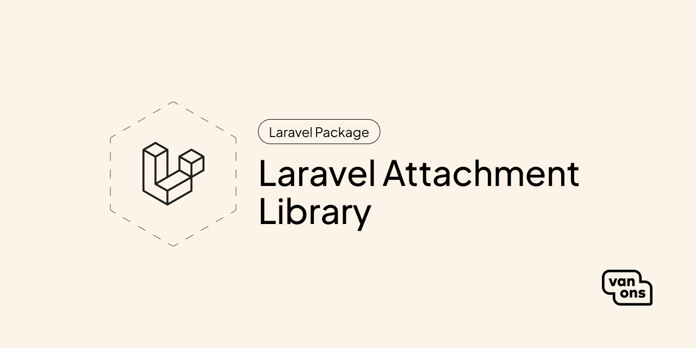

# Laravel Attachment Library

## Contents
1. [Introduction](introduction.md)
2. [Requirements](requirements.md)
3. [Installation](installation.md)
    1. [Composer](installation.md#composer)
    2. [Setup](installation.md#setup)
    3. [Configuration](installation.md#configuration)
4. [Upgrading](upgrading.md)
5. [Changelog](changelog.md)
6. [Basic usage](basic-usage/README.md#contents)
   1. [Configuring your model](basic-usage/configuring-your-model.md)
   2. [Manage attachments and directories](basic-usage/manage-attachments-and-directories.md)
      1. [Attachments](basic-usage/manage-attachments-and-directories.md#attachments)
      2. [Directories](basic-usage/manage-attachments-and-directories.md#directories)
   3. [Responsive images](basic-usage/responsive-images.md)
      1. [Manually resize image](basic-usage/responsive-images.md#manually-resize-image)
7. [Advanced usage](advanced-usage/README.md#contents)
   1. [Extending the package](advanced-usage/extending-the-package.md)
   2. [File namers](advanced-usage/file-namers.md)
   3. [Metadata retrievers](advanced-usage/metadata-retrievers.md)

---

